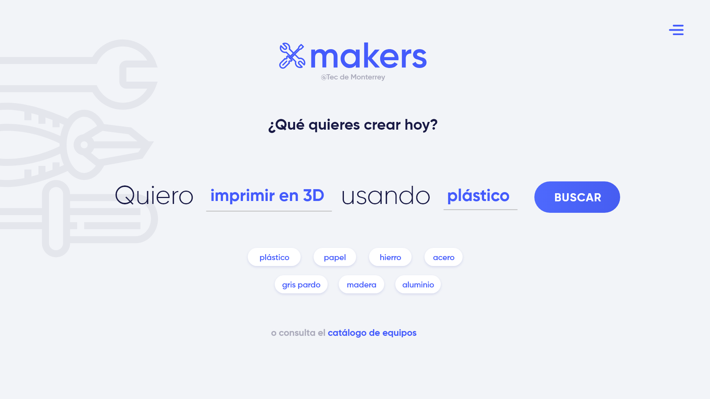
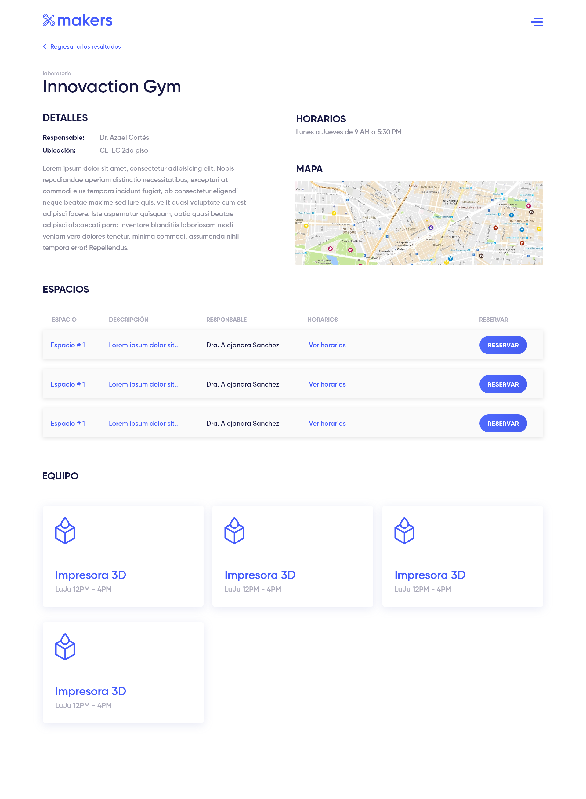

# Manual de usuario

El siguiente documento presenta un manual para el usuario de la plataforma Makers y pretende ser una gu&iacute;a para la realizaci&oacute;n de las actividades.

### Home

En primera instancia el usuario llegar&aacute;a a la p&aacute;gina de inicio de la aplicaci&oacut;en, que representa un buscador en funci&oacute;n de sus necesidades:

Se presentan dos campos para la búsqueda de equipos o maquinaria, que representan los dos tipos de búsqueda que se pueden realizar: por capacidad o por material.

El usuario puede aquí ingresar cualquiera de los dos campos para inicar una búsqueda. Conforme se escriba en cualquiera de los dos campos en la sección inmediatamente inferior a la frase de búsqueda se presentan opciones de capacidades o materiales (según sea el caso) que es posible insertar en estos campos. Estos campos se filtaran con base en lo que el usuario ha escrito en el capo indicado.

De las opciones presentadas el usuario debe elegir una o más en al menos uno de los campos para poder ingresar una búsqueda.

Se presenta además la opción de ver el catálogo completo de equipos al hacer click en el link presentado en la parte inferior de la pantalla.

Una vez que se seleccione al menos uno de los filtros, el botón de búsqueda (azul derecho) se habilitará y el usuario podrá iniciar una búsqueda, que lo llevará al siguiente listado de resultados:

### Listado de laboratorios

El listado de laboratorios es una lista que presenta el catálogo completo de laboratorios registrados en la plataforma.

Para cada laboratorio se presenta el nombre, horarios, ubicación y un set de tags de capacidades del mismo, así como un botón "Ver detalles" para ir a la pantalla de detalles del laboratorio específico.

En la parte superior de la pantalla se presenta una bárra de búsqueda con el que el usuario puede filtrar dinámicamente (instantáneamente) la lista completa basado en el título.

### Detalle de laboratorio

En la pantalla del detalle del laboratorio se muestra toda la información registrada sobre el laboratorio, incluyendo una descripción, ubicación, horarios, encargados, espacios disponibles y equipos (maquinaria) disponible en el laboratorio.

Para cada uno de los espacios y equipos se puede expander el recuadro para obtener más información sobre el espacio o equipo.

### Registro de equipos

Para cada laboratorio y si se tiene permisos de administrador, éste puede registrar equipos nuevos para el laboratorio. 

Una vez que se seleccione la opción de **Agregar equipo**, se despliega el siguiente formulario:

En este formulario el usuario deberá introducir un nombre para el equipo, una descripción, una lista de capacidades y materiales y opcionalmente una foto.

En este formulario también es posible definir los horarios en los que el equipo va a estar disponible así como agregar capacitaciones requeridas para el equipo en particular.

### Registro de usuario

En la pantalla de registro se presenta un formulario en el que el usuario deberá introducir su información personal (Nombre, Apellido, Matrícula y correo electrónico) y una contraseña para poder ingresar de manera segura a la plataforma.

### Inicio de sesión

En la pantalla de inicio de sesión el usuario deberá introducir el correo electrónico y la contraseña con las que está registrado en el sistema.

### Restablecer Contraseña

En dado caso que el usuario haya olvidado su contraseña, puede seleccionar, dentro de las pantallas de "Inicia Sesión", la liga "¿Olvidaste tu contraseña?". Una vez ingresado el correo electrónico vinculada a la cuenta del usuario, selecciona el botón de "Envíame instrucciones para restablecer contraseña" y se le hará llegar un correo con las instrucciones para restablecer contraseña.

En dado caso que el usuario aún no ha recibido las instrucciones para restablecer contraseña, puede solicitarlas de nuevo al ingresar a la liga "¿No recibiste insutrucciones de confirmación?".
